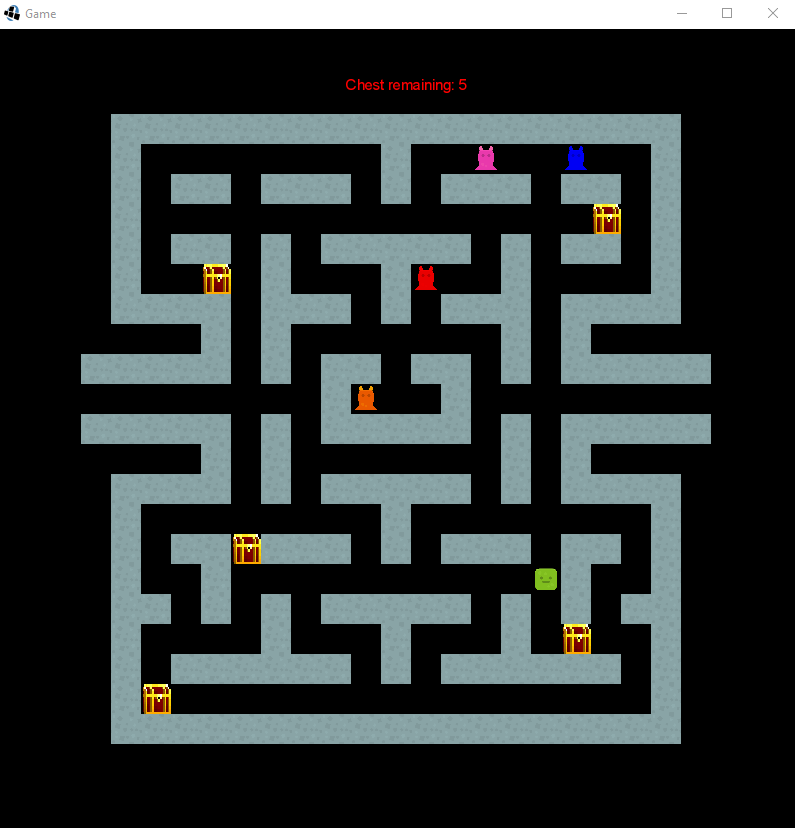

# Maze runner
Welcome to my first game with libgdx, this is just a small project for testing libgdx 

# How to play
If you want to play download the repository and run maze runner.jar 

# LibGdx

libGDX is a free and open-source game-development application framework written in the Java programming language with some C and C++ components for performance dependent code. It allows for the development of desktop and mobile games by using the same code base. It is cross-platform, supporting Windows, Linux, Mac OS X, Android, iOS, BlackBerry and web browsers with WebGL support.

# Controls

A - LEFT 
W - UP 
S - DOWN 
D - RIGHT 

# Goal

Try to get all the chest but care with the ghosts!

